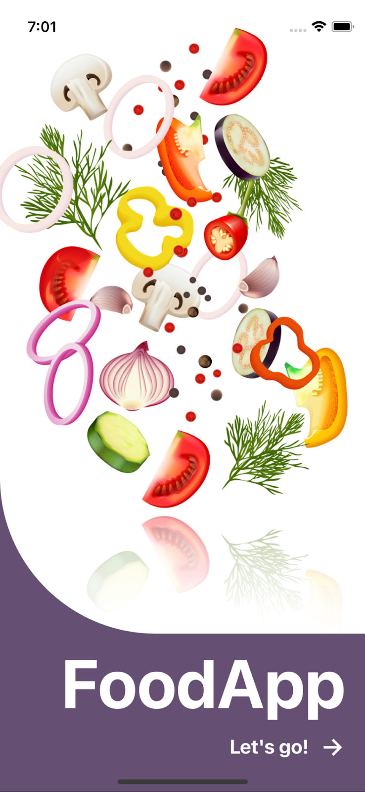
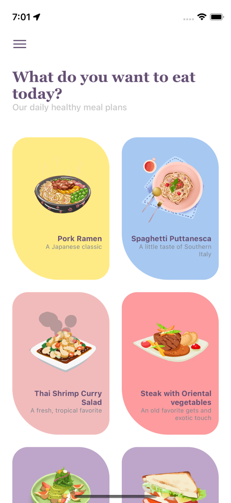
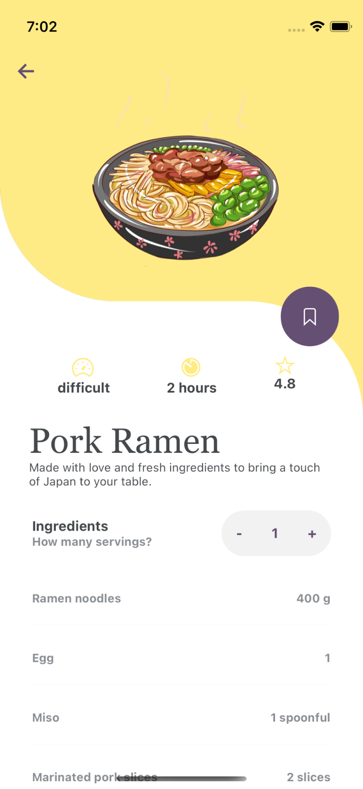

# FoodApp
## Présentation
Application mobile de recettes de cuisine permettant de gérer des favoris et d’adapter dynamiquement les quantités selon le nombre de parts. Réalisée à partir d’éléments graphiques fournis et d’une maquette.

## Stack Technique
- JavaScript
- React Native
- Expo
- [Redux Toolkit](https://redux-toolkit.js.org/)

## Capture d'Ecran

<table>
  <tr>
    <td></td>
    <td></td>
    <td></td>
  </tr>
</table>
